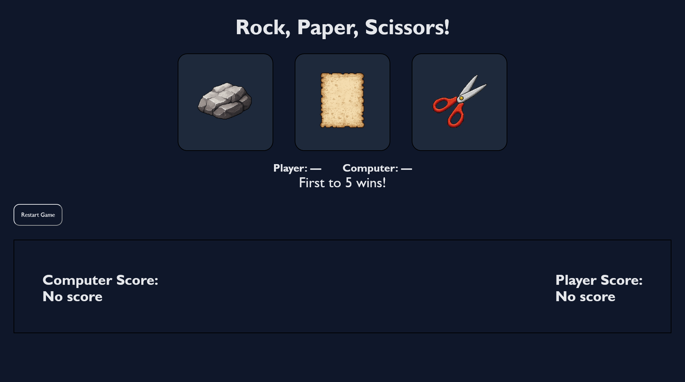

<h1>Rock, Paper, Scissors</h1>

A browser-based Rock, Paper, Scissors game built with
<strong>HTML, CSS, and JavaScript</strong>.

<h2>Screenshot</h2>

<h2>Features</h2>
<ul>
    <li>Clickable Rock / Paper / Scissors cards</li>
    <li>Animated hover, win, lose, and tie feedback</li>
    <li>Live score tracking for player and computer</li>
    <li>Visual display of both player and computer choices</li>
    <li>Animations disabled automatically when the game ends</li>
    <li>Restart button to reset the game state</li>
</ul>

<h2>Game Rules</h2>
<ul>
    <li>Rock beats Scissors</li>
    <li>Scissors beats Paper</li>
    <li>Paper beats Rock</li>
    <li>First to reach 5 points wins</li>
</ul>

<h2>User Interface Behavior</h2>
<ul>
    <li>
        <strong>Win:</strong> selected card pulses green
    </li>
    <li>
        <strong>Loss:</strong> selected card shakes and turns red
    </li>
    <li>
        <strong>Tie:</strong> selected card turns gray
    </li>
    <li>
        <strong>Game Over:</strong>
        <ul>
            <li>All animations stop</li>
            <li>Cards are no longer clickable</li>
        </ul>
    </li>
    <li>
        <strong>Restart:</strong> restores animations and interaction
    </li>
</ul>

<h2>Future Improvements</h2>
<ul>
    <li>Keyboard controls</li>
    <li>Sound effects (maybe)</li>
    <li>Round history log</li>
    <li>Theme toggle</li>
    <li>Fix button to be centered</li>
</ul>

